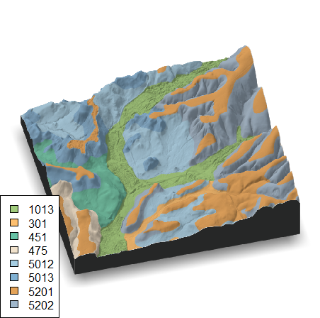

# dem-to-block_diagram.R

## Last Revised: 02/28/2020
## Authors: Andrew Paolucci, Andrew Brown, Dylan Beaudette



# Get the script

This document explains how to use the `rayshader` R package to create 3-D thematic block diagrams from digital elevation models and a thematic shapefile.

Download the __R__ script here: [dem-to-block_diagram.R](dem-to-block_diagram.R)

This script folder contains two demonstration inputs:

 * _demo_dem.tif_ - LiDAR DEM (1m x 1m resolution) for small extent
 
 * _demo_ssurgo.tif_ - SSURGO data corresponding to demo_dem.tif extent
 
Try running the script with these files to see a quick example and make sure all essential components of the script are working.

# Install dependencies

Install the required packages.

```
install.packages('rayshader','rgl','raster','rgdal','gstat','RColorBrewer','sf','fasterize','gstat')
```

# Setup

There are a few options you will need to customize to run the script with your own data. The most important are your thematic shapefile (what are you plotting) and the DEM you will use as your base. There are also other options related to the extent of plotting, groups and color palettes.

## Thematic Shapefile

Set the path to the shapefile/feature class you want to overlay on your 3D landscape.

```
## 1. read shapefile for overlay (must cover full extent of elevation .TIF)
#       for example, ssurgo data symbolized on musym
thematic_shp <- st_read('dredge_ssurgo.shp', stringsAsFactors = FALSE)
```

## Thematic Attribute
Set the _thematic attribute_ -- the column name in shapefile attribute table containing what you would like to symbolize.  If necessary, specify any levels to omit with `omit.groups`.

```
## 2. thematic attribute - the column name in shapefile attribute table 
mu.col <- "MUSYM"

# group levels in mu.col to omit from result
omit.groups <- c("W")
```

## Digital Elevation Model
Load a raster digital elevation model (.TIF) for a chunk of space. You can easily create this for a desired extent by panning to area in ArcMap, and _Data_ > _Export Data_ > _By Data Frame_.

```
## 3. digital elevation model (TIFF, or other raster-compatible format) for a chunk of space
#     e.g. pan to desired area in ArcMap, and Data > Export Data > By Data Frame
elev_orig <- fasterize::raster('YOURDEM.tif')
```
If needed, define additional extent constraints (default uses full extent of DEM)

```
# example: take a small subset (1/100th) of the DEM
extent.poly <- st_as_sf(as(extent(elev_orig) / 10, 'SpatialPolygons'))
extent.poly <- st_set_crs(extent.poly, crs(elev_orig))
```

### OPTIONAL: Resampling and Interpolating DEM input

If needed, you can resample your elevation raster to some other resolution/grid size. Note that the DEM/hillshade and any derived overlays/shadows will all be in the _same resolution_ as the elevation matrix. 

If you have very detailed/large rasters, creating the elevation derivatives will take a long time and _rgl_ (3D visualization package) will run slow. It will be to your benefit to reduce resolution in this case.

```
## 4. OPTIONAL: resample raster input, default is same as DEM
target_resolution <- c(5,5) # target is 5m x 5m grid
```

Depending on DEM origin/level of detail there may be value in performing some interpolaton on the resampled result -- to remove artefacts or unnecessary detail. Set `idw_smooth` to TRUE to use this feature. By default, the 7x7 focal median is taken following the interpolation. Also, select the percentage of the input DEM to use in the IDW interpolation.

```
## 5. Apply inverse-distance weighting interpolation to minimize DEM artifacts?
idw_smooth <- FALSE
focal_length <- 7 # size of focal window (an n x n square)
pct_dem_train <- 15 # random % of DEM to use in spatial interpolation (100% = exact match)
gstat.nmax <- 5 # number of neighbors to use in making prediction
```

## Setting Custom Colors
After the input thematic shapefile has been rasterized, colors are assigned. By default, a set of colors that spans the color ramp that matches the number of unique levels in `mu.col` is used to render the map.

There is a section of commented-out code that allows you to modify the default set.  Here is the code that you would need to edit. Note you will need to account for any groups you are omitting in the indexing of your color vector.

```
# replace individual colors (Optional) RGB Method colors[4] <- rgb(0,0,132/255)
new.colors[1] <- "#E4A358" 
new.colors[2] <- "#A0B7CB" 
new.colors[3] <- "#A1CC7D" 
#new.colors[4] <- "#FFFFB3" 
#new.colors[5] <- "#FDBF6F" 
#new.colors[6] <- "#999999" 
```

## Changelog:

 * _2019/03/12_ - initial commit
 
 * _2019/04/05_ - replaced `raster::rasterize()` with `fasterize::fasterize()` for making thematic raster much faster
 
 * _2020/02/28_ - updates to conform with new _rayshader_ 0.13.x; removed _FedData_, _imager_, _viridis_ dependencies; added _gstat_ IDW interpolation option; added _group.omit_ option; better color selection code and implementation of masking from Andy Paolucci; switched over to using _sf_ for most spatial operations